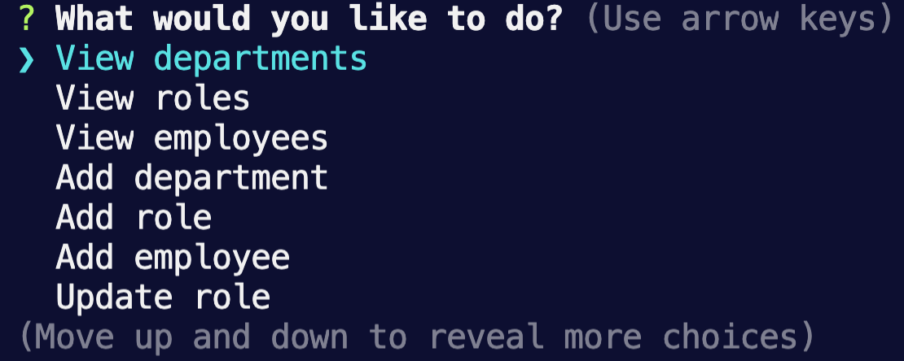

# EMPLOYEE TRACKER

### PURPOSE:
Developers are often tasked with creating interfaces that make it easy for non-developers to view and interact with information stored in databases. Often these interfaces are known as **C**ontent **M**anagement **S**ystems. The purpose of this assignment was to architect and build a solution for managing a company's employees using node, inquirer, and MySQL. 

This command-line application allows the user to:
  * Add departments, roles, employees
  * View departments, roles, employees
  * Update employee roles

### TECHNOLOGIES:
* HTML
* CSS
* Javascript
* NodeJS
* mySQL

### SCREENSHOT:

### INFORMATION:
[Here](https://github.com/maxonemillion/EmployeeTracker "Link to github repository") is the Github repository for this project.

### CONTACT:
* max.daniel@utah.edu
* [LinkedIn](https://www.linkedin.com/in/maximilian-daniel1/ "Link to LinkedIn page")
* [Github](https://github.com/maxonemillion "Link to Github page")
